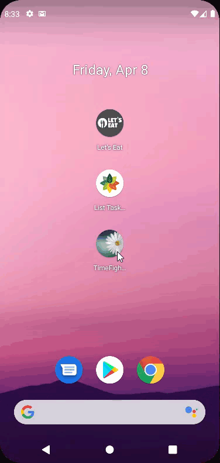

<strong><em>Thanks for your reading, please give me a STAR!<em><strong>

### "To be an Android Engineer"
###### (I'm Nguyen Truong Thinh)
___
#### Introduction
"Android mobile development has been Kotlin-first since Google I/O in 2019" 
I follow the latest trends & technology in the market.  I make sure my code is of production quality. 
___
#### #1: Time Fighter
- This is a pretty simple but quality app. 
- The app allows users to touch a button for a period of 60 seconds with friendly animations. 
- Currently, the application supports 2 languages: English and Vietnamese. 
  
#### #2: List Tasks Maker
- The app allows users to create to-do tasks list. 
- For each task, there will be its own list of tasks. 
- The app supports both tablet and phone interfaces. 
- Currently, the application supports 2 languages: English and Vietnamese. 
  
#### #3: Let's Eat
- The app allows users to make notes (needed to warn your future self about some heartburn-inducing greasy food from a roadside diner;  or the users wanted to keep reminders about the best menu items at your favorite local restaurants) about the restaurant or other places. 
- An app that lets you bookmark and makes notes using a map-based interface. 
- It displays a map, tracks the user's location, and adds custom markers. 
- The map will display regular places, and allow the users to bookmark them.
- The navigation drawer on the left will display all of your bookmarks, and the users can tap on one and zoom them to that location.
- The users can display details for bookmarked places, and edit or delete the place data, and a corresponding photo.
- It displays place info, searches for nearby places, and jumps directly to them on the map.
- Currently, the application supports 2 languages: English and Vietnamese. 
  
___
### License: MIT
